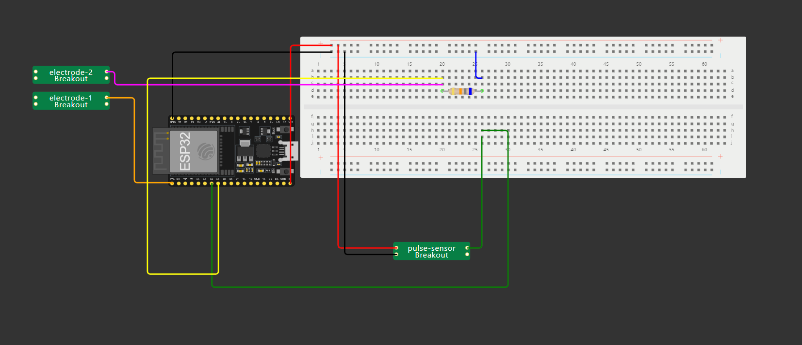

# Entwicklungsprotokoll: Herzfrequenz- und Hautwiderstandsmessgerät

## 14.11.24
- Messgerätaufbau überlegt
- Bauteile bestellt (Herzfrequenzsensor, USB-A auf Mikro-USB Kabel)
- WLAN-Einstellungen für den Arduino einprogrammiert
- Rubrik für Datenübertragung mit einem Deno.serve HTTP Server und HTTP Requests programmiert 

## 20.11.24
- Bauteile empfangen
- Herzfrequenzsensor ausgetestet & Herzfrequenzsensor aufgebaut
- Anleitung/Protokoll für den Messgerätaufbau nachgebessert

## 21.11.24
- Herzfrequenzsensor programmieren
- Widerstandssensor bauen & programmieren
- Kommentare, Messgerätbauanleitung erweitern und Schaltplan erstellen

## 22.11.24
- Finaler Aufbau aller 4 Messgeräte nach Schaltplan
- Anfang Gehäuse der Messgeräte

## 23.11.24
- Gehäuse der Messgeräte fertigstellen
- Datenverarbeitung auf dem Deno-Server programmiert

## 24.11.24
- Testen aller Messgeräte mit Verbindung zum Server

## Schaltplan
