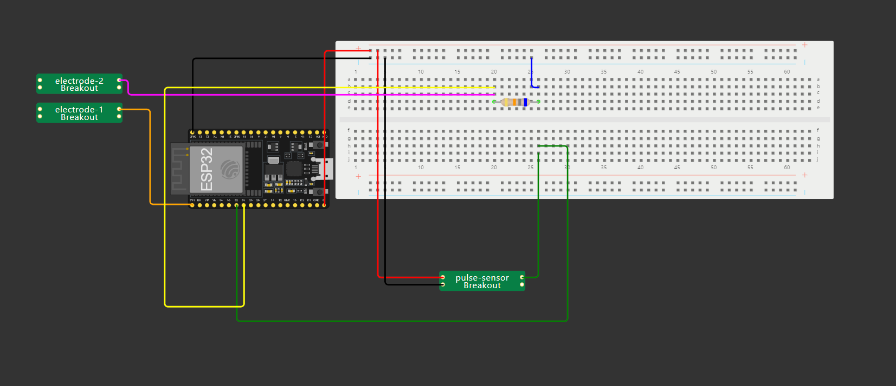

# Messgeräte
## Widerstandsmessgerät

#### Bauweise:
- Doppelseitiges Klebeband auf Klettband ankleben
- Messdraht auf Klebeband ankleben
- Alu in Kontakt mit draht zum Klebeband ankleben
- Rückseite mit Tesa festmachen

#### Verwenden:
- Die zwei Sensoren eng an dem kleinen Finger in maximalem Abstand an der passiven Hand ankleben
- Die Sensoren wie im Schaltplan beschrieben an ESP anschließen 

## Herzfrequenzmessgerät

#### Bauweise:
- Doppelseitiges Klebeband an ein ausreichend langes Velcro-Klettband kleben, Sensor an das Klebeband kleben

#### Verwenden:
- Den Sensor mithilfe des Klettbands eng an den Daumen schließen
- Den Sensor wie im Schaltplan beschrieben an ESP anschließen

## Schaltplan
